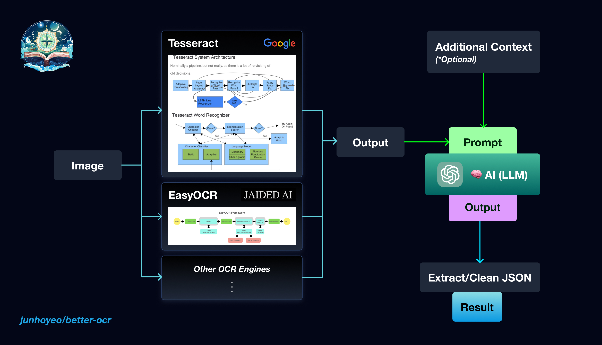
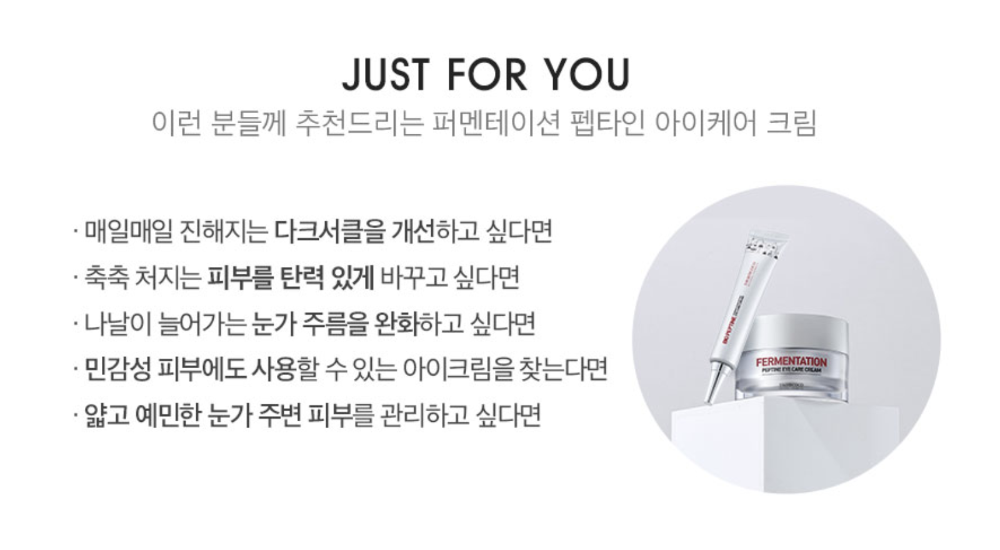

<p align="center">
  <a href="https://github.com/junhoyeo">
    
  </a>
</p>
<h1 align="center">BetterOCR</h1>

> 🔍 Better text detection by combining OCR engines with 🧠 LLM.

OCR _still_ sucks! ... Especially when you're from the _other side_ of the world (and face a significant lack of training data in your language) — or just not thrilled with noisy results.

**BetterOCR** combines results from multiple OCR engines with an LLM to correct & reconstruct the output.

- **🔍 OCR Engines**: Currently supports [EasyOCR](https://github.com/JaidedAI/EasyOCR) and [Tesseract](https://github.com/tesseract-ocr/tesseract).
- **🧠 LLM**: Supports models from OpenAI.
- **📒 Custom Context**: Allows users to provide an optional context to use specific keywords such as proper nouns and product names. This assists in spelling correction and noise identification, ensuring accuracy even with rare or unconventional words.

Head over to [💯 Examples](#-Examples) to see the performace for yourself!

Coming Soon: improved interface, async support, box detection, and more.

> **Warning**<br/>
> This package is under rapid development 🛠

<a href="https://github.com/junhoyeo">
  
</a>

> Architecture

## 🚀 Usage (WIP)

```bash
pip install betterocr
# pip3 install betterocr
```

```py
import betterocr

text = betterocr.detect_text(
    "demo.png",
    ["ko", "en"],
    context="",
    tesseract={"config": "--tessdata-dir ./tessdata"},
    openai={"model": "gpt-4"},
)
print(text)
```

## 💯 Examples

> **Note**<br/>
> Results may vary due to inherent variability and potential future updates to OCR engines or the OpenAI API.

### Example 1 (English with Noise)


| Source | Text |
| ------ | ---- |
| EasyOCR | `CHAINSAWMANChapter 109:The Easy Way to Stop Bullying~BV-THTSUKIFUUIMUTU ETT` |
| Tesseract | `A\ ira \| LT ge a TE ay NS\nye SE F Pa Ce YI AIG 44\nopr See aC\n; a) Ny 7S =u \|\n_ F2 SENN\n\ ZR\n3 ~ 1 A \ Ws —— “s 7 “A\n=) 24 4 = rt fl /1\n£72 7 a NS dA Chapter 109:77/ ¢ 4\nZz % = ~ oes os \| \STheEasf Way.to Stop Bullying:\n© Wa) ROT\n\n` |
| LLM | 🤖 GPT-3.5 |
| **Result** | **`CHAINSAWMAN\nChapter 109: The Easy Way to Stop Bullying`** |

### Example 2 (Korean+English)



| Source | Text |
| ------ | ---- |
| EasyOCR | `JUST FOR YOU이런 분들께 추천드리는 퍼멘테이선 팬타인 아이켜어 크림매일매일 진해지논 다크서클올 개선하고 싶다면축축 처지논 피부름 탄력 잇게 바꾸고 싶다면나날이 늘어가는 눈가 주름올 완화하고 싶다면FERMENATION민감성 피부에도 사용할 수잇는 아이크림올 찾는다면얇고 예민한 눈가 주변 피부름 관리하고 싶다면`                                                                              |
| Tesseract | `9051 508 \ㅇ4\n이런 분들께 추천드리는 퍼멘테이션 타인 아이케어 크림\n.매일매일 진해지는 다크서클을 개선하고 싶다면        "도\nㆍ축축 처지는 피부를 탄력 있게 바꾸고 싶다면         7\nㆍ나날이 늘어가는 눈가 주름을 완화하고 싶다면        /\n-민감성 피부에도 사용할 수 있는 아이크림을 찾는다면    (프\nㆍ않고 예민한 눈가 주변 피부를 관리하고 싶다면                         밸\n\n` |
| LLM | 🤖 GPT-3.5 |
| **Result** | **`JUST FOR YOU 이런 분들께 추천드리는 퍼멘테이션 팬타인 아이케어 크림\n매일매일 진해지는 다크서클을 개선하고 싶다면\n축축 처지는 피부를 탄력 있게 바꾸고 싶다면\n나날이 늘어가는 눈가 주름을 완화하고 싶다면\n민감성 피부에도 사용할 수 있는 아이크림을 찾는다면\n얇고 예민한 눈가 주변 피부를 관리하고 싶다면`** |

### Example 3 (Korean with custom `context`)


| Source | Text |
| ------ | ---- |
| EasyOCR | `바이오함보#세로모공존존세럼6글로우픽 설문단 100인이꼼꼼하게 평가햇어요"#누적 판매액 40억#제품만족도 1009` |
| Tesseract | `바이오힐보\n#세로모공폰폰세럼\n“글로 으피 석무다 1 00인이\n꼼꼼하게평가했어요”\n\n` |
| Context | `[바이오힐보] 세로모공쫀쫀세럼으로 콜라겐 타이트닝! (6S)` |
| LLM | 🤖 GPT-4 |
| **Result** | **`바이오힐보\n#세로모공쫀쫀세럼\n글로우픽 설문단 100인이 꼼꼼하게 평가했어요\n#누적 판매액 40억\n#제품만족도 100%`** |

#### 🧠 LLM Reasoning

Based on the given OCR results and the context, here is the combined and corrected result:

```
{
  "data": "바이오힐보\n#세로모공쫀쫀세럼\n글로우픽 설문단 100인이 꼼꼼하게 평가했어요\n#누적 판매액 40억\n#제품만족도 100%"
}
```

- `바이오힐보` is the correct brand name, taken from [1] and the context.
- `#세로모공쫀쫀세럼` seems to be the product name and is derived from the context.
- `글로우픽 설문단 100인이 꼼꼼하게 평가했어요` is extracted and corrected from both OCR results.
- `#누적 판매액 40억` is taken from [0].
- `#제품만족도 100%` is corrected from [0].

## License (Starmie!)

<p align="center">
  <strong>MIT © <a href="https://github.com/junhoyeo">Junho Yeo</a></strong>
</p>

<p align="center">
  <a href="https://github.com/junhoyeo">
    
  </a>
</p>

If you find this project interesting, **please consider giving it a star(⭐)** and following me on [GitHub](https://github.com/junhoyeo). I code 24/7 and ship mind-breaking things on a regular basis, so your support definitely won't be in vain!
